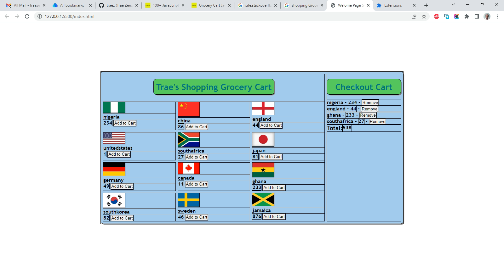

# jsbeginners.com - Shopping Grocery Cart solution

This is a solution to the [Shopping Grocery Cart JavaScript Project on JS Beginners](https://jsbeginners.com/grocery-cart-javascript-project/). I am trying to improve my coding skills by building realistic projects. 

## Table of contents

- [Overview](#overview)
  - [The challenge](#the-challenge)
  - [Screenshot](#screenshot)
  - [Links](#links)
- [My process](#my-process)
  - [Built with](#built-with)
  - [What I learned](#what-i-learned)
  - [Continued development](#continued-development)
  - [Useful resources](#useful-resources)
- [Author](#author)
- [Acknowledgments](#acknowledgments)

## Overview

### The challenge

Users should be able to:

- In the cart section of the website, when you click on a given cart button, a JavaScript alert should pop up, letting you know that your item was added.  
- Added items will appear in the cart section in the top right-hand corner of the website.  
- The total amount of the added items will show in the running total.  
- When you delete an item, change should reflect in the cart.  

### Screenshot

### Links

- Solution URL: [https://github.com/traez/tip-calculator](https://github.com/traez/tip-calculator)
- Live Site URL: [https://traez.github.io/tip-calculator/](https://traez.github.io/tip-calculator)

## My process

### Built with

- Semantic HTML5 markup
- CSS custom properties
- Flexbox
- CSS Grid
- JavaScript

### What I learned

1) Work ongoing. DOM manipulation learning continues. 

### Continued development

1) This was my second real respectable JavaScript project done with no cloning. Trying to build from the ground up, so picking challenges I can complete independently with no cloning, aside "stackoverflow research".   

### Useful resources

Stackoverflow, MDN Web Docs, w3schools, YouTube, Google 

## Author

- Website - [Trae Zeeofor](https://github.com/traez)  
- Twitter - [@trae_z](https://twitter.com/trae_z) 

## Acknowledgments

Congrats to The Flamingoes for placing third at the 2022 FIFA Women U-17 WorldCup. You inspire me to keep pursuing my dreams.  
